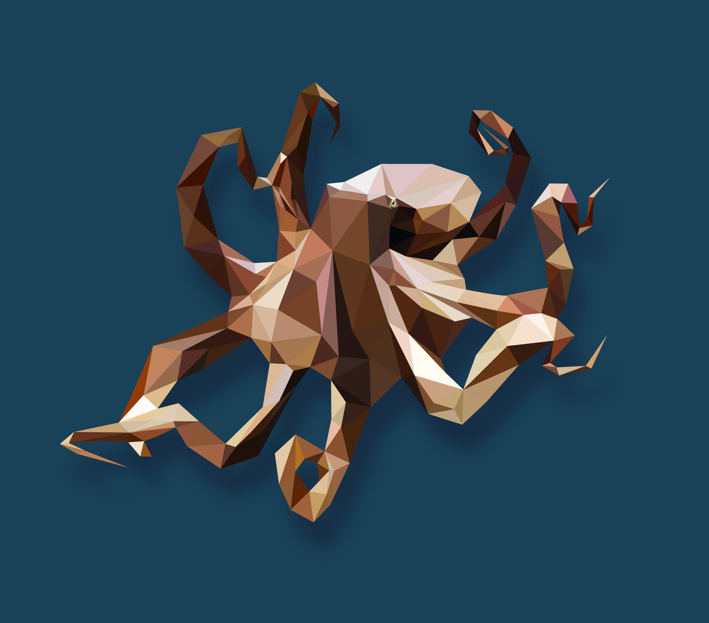

## Icon sets, colours, and other materials</h4>

<h5 align="center">palette</h5>

  <svg width="100%" height="60">
    <rect width="18%" height="100" style="fill:rgb(230,204,203)" />
    <rect x="20.5%" width="18%" height="100" style="fill:rgb(78,45,26)" />
    <rect x="41%" width="18%" height="100" style="fill:rgb(180,112,37)" />
    <rect x="61.5%" width="18%" height="100" style="fill:rgb(25,65,88)" />
    <rect x="82%" width="18%" height="100" style="fill:rgb(13,31,34)" />
  </svg>  

 

<h5 align="center">main icon</h5>

  </img>

 

<h5 align="center">app icon</h5>

  </img>

 

<h5 align="center">octopoly</h5>

  </img>

 

<h5 align="center">wallpaper</h5>

  </img>

